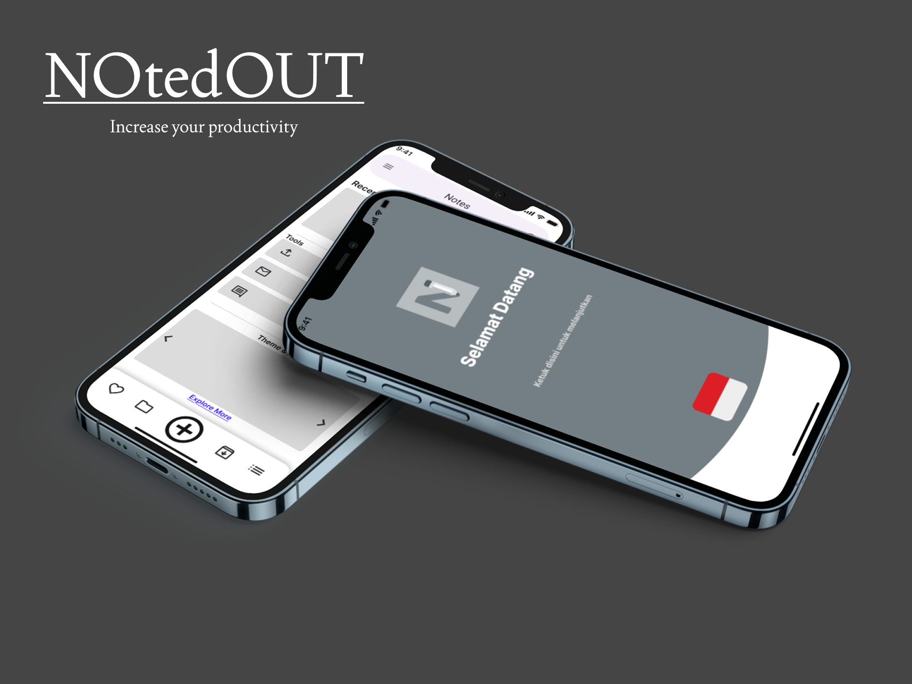
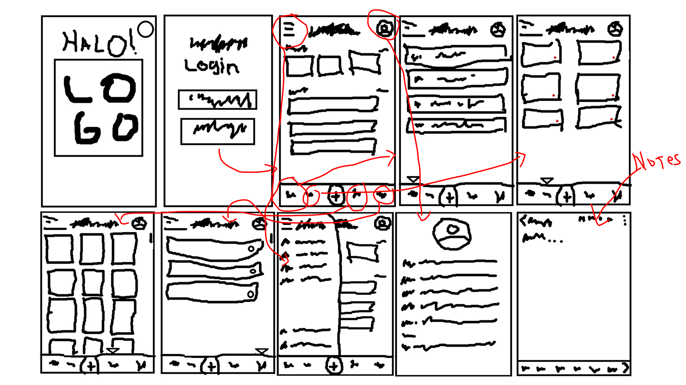
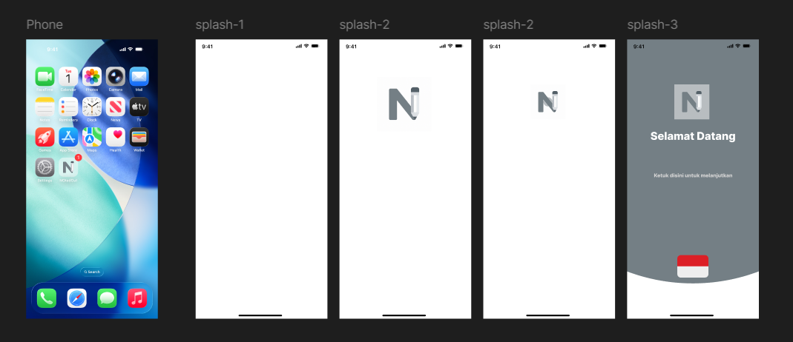
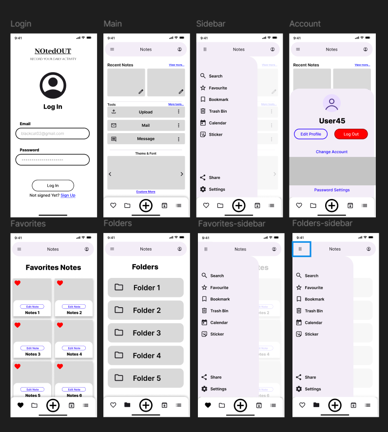

# UTS Pemrograman Mobile
```
Nama   : Fathan Atallah Rasya Nugraha
NIM    : 312410425
Kelas  : TI.24.A3
```
# Rancangan Mobile APPS : Aplikasi Notepad

## NOtedOUT
NOtedOUT adalah aplikasi catatan dengan fitur yang cukup lengkap. DIdalamnya terdapat fitur seperti menyusun catatan kedalam folder, memberikan favorit pada catatan, dan bahkan bisa berkomunikasi dengan orang lain.<br>
<br>
*Mockup*<br>


### Storyboard
<br>

### Splash Screen
<br>

### UI Frame
<br>

Untuk tampilan UX dan penjelasan lebih lengkap saya jelaskan dalam link youtube berikut ini :<br>
https://youtu.be/YhBKTJ9r5zg
